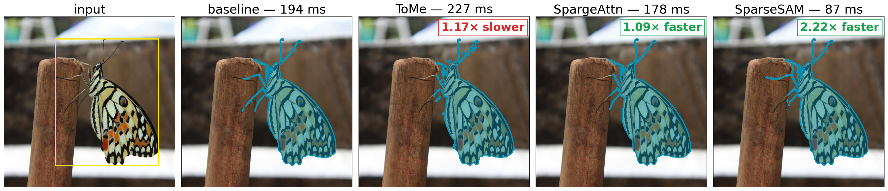

<br />
<p align="center">
  <h1 align="center">SparseSAM: Structured Sparsification of Activations<br/>in Segment Anything Models</h1>

  <p align="center">
    <strong>Anonymous Authors</strong>
  </p>

  <p align="center">
    <a href="https://www.python.org/downloads/release/python-3120/">
      </a>
    <a href="https://pytorch.org/">
      </a>
    <a href="https://opensource.org/licenses/Apache-2.0">
      </a>
  </p>
</p>
<br />

<p align="center">
  
</p>

This repository contains the official PyTorch implementation of SparseSAM, a training-free framework that accelerates the Segment Anything Model (SAM) by **2×** with **2.8× memory reduction** and only **<1% IoU loss**. All algorithm implementations live under [`algos/`](algos/) and can be patched on top of the original checkpoints without retraining.

## Table of Contents

- [Abstract](#abstract)
- [Folder layout](#folder-layout)
- [Installation](#installation)
- [Supported tasks](#supported-tasks)
  - [SAM HQ-44K segmentation](#sam-hq-44k-segmentation)
  - [SAM MS-COCO box-prompted](#sam-ms-coco-box-prompted)
  - [Perception Encoder ImageNet zero-shot](#perception-encoder-imagenet-zero-shot)
- [Results](#results)
- [Multi-GPU profiling](#multi-gpu-profiling)
  - [Encoder speedup across GPUs](#encoder-speedup-across-gpus)
  - [Memory savings](#memory-savings)
  - [Full pipeline throughput and efficiency](#full-pipeline-throughput-and-efficiency)
  - [Accuracy](#accuracy)
  - [Implementation vs algorithmic gain](#implementation-vs-algorithmic-gain)
- [Adding a new algorithm](#adding-a-new-algorithm)
- [Citation](#citation)
- [Acknowledgement](#acknowledgement)

## Abstract

The Segment Anything Model (SAM) achieves strong open-vocabulary segmentation,
but its ViT-based image encoders dominate inference latency and memory. Existing
activation-compression methods such as token merging reduce token length yet
introduce non-trivial runtime overhead and suffer catastrophic quality drops
under high compression. Sparse-attention methods, on the other hand, focus on
attention alone and leave the MLP fully dense, capping achievable speedup.

We propose **SparseSAM**, a *training-free structured sparsification* framework
that jointly accelerates attention **and** MLP layers while preserving token
identity. SparseSAM introduces:

- **Stripe-Sort Attention** — a deterministic Z-order permutation that
  transforms dense attention into a static hardware-friendly sparse pattern,
  eliminating dynamic masking overhead.
- **Residual-Consistency MLP** — routes only informative tokens through the
  MLP while propagating remaining tokens through the residual pathway.

Across four segmentation benchmarks SparseSAM loses only **0.004 mIoU** at 0.4
density and **0.021 mIoU** at 0.3 — a **2.10× reduction in accuracy loss**
versus token-merging — while delivering **2× faster inference and 2.8× memory
reduction**.

---

## Folder layout

```
algos/                          # all algorithm code + vendored upstream models
├── registry.py                   unified AlgoSpec + register() for SAM / PE
├── tome/                         Token Merging (bipartite soft matching)
├── gradtome/                     Gradient-aware bipartite matching (StructSAM)
├── sparsesam/                    SparseSAM Stripe-Sort attn + Residual-Consistency MLP
├── sparge/                       SpargeAttn drop-in sparse attention (integration layer)
├── piecewise/                    Piecewise sparse attention integration for SAM-HQ
├── kernels/                      fused cutlass-DSL CUDA kernels (FA2 + rel-pos / RoPE)
└── 3rd_party/                    upstream model sources (vendored submodules)
    ├── sam-hq/                     SAM-HQ model + predictor + train pipeline
    ├── perception_models/          Meta's Perception Encoder source
    ├── SpargeAttn/                 SpargeAttn block-sparse attention kernels (pip install -e)
    ├── piecewise-sparse-attention/ Piecewise sparse attention reference implementation
    └── lmms-eval/                  (unused; kept for archival)

tasks/                          # eval / profile entry points, grouped by task
├── sam_hq44k/                    SAM-HQ on HQ-44K
├── sam_coco/                     SAM-HQ on MS-COCO val2017 with GT-box prompts
├── sam_profile/                  SAM per-component / per-attn-layer profilers
└── pe_imagenet/                  PE zero-shot CLIP eval + per-block profiler

utils/                          # shared data loading + benchmark helpers
docs/                           # contributor docs — start here when adding an algo
benchmark_results/              # CSV outputs + saved plots
ckts/                           # SAM-HQ checkpoints
data/                           # DIS5K, thin_object_detection, coco, imagenet, …
```

All compression algorithms are runtime patches: they monkey-patch the encoder's
transformer blocks at apply time and revert cleanly, so the original checkpoints
stay unchanged and a single eval run can sweep several `(algo, ratio)` configs
back-to-back. Each task ships both a `*.py` entry point and a `*.sh` wrapper;
most knobs (model, batch size, algos, ratios) are env-overridable from the wrapper.

---

## Installation

Tested on **Python 3.12**, **PyTorch 2.5.1 + CUDA 12.1**. The code runs on Python 3.10–3.12; pick whichever matches your CUDA toolchain.

```bash
# 1. Clone with submodules
git clone --recurse-submodules <repo-url> SparseSAM
cd SparseSAM
# (or, if already cloned)
git submodule update --init --recursive

# 2. Env + PyTorch (must match your CUDA)
conda create -n sam python=3.12 -y && conda activate sam
pip install torch==2.5.1 torchvision==0.20.1 --index-url https://download.pytorch.org/whl/cu121

# 3. Repo + extra deps
pip install -e .
pip install -r requirements.txt

# 4. Vendored submodules that ship as Python packages
pip install -e algos/3rd_party/sam-hq
pip install -e algos/3rd_party/perception_models
pip install -e algos/3rd_party/piecewise-sparse-attention
```

Optional / kernel deps:

```bash
# Flash-Attention 2 (used by some PE patches + the FA2+RoPE fused kernel)
pip install flash-attn==2.8.3 --no-build-isolation

# xFormers (memory-efficient attention; required by perception_models)
pip install xformers==0.0.35

# SpargeAttn — CUDA extension. The HF `kernels` package can break setuptools
# egg_info on some envs; if `pip install -e` fails, run setup.py develop directly:
TORCH_CUDA_ARCH_LIST=8.0 MAX_JOBS=4 python algos/3rd_party/SpargeAttn/setup.py develop
```

Expected layout for data and checkpoints:

```
ckts/                            SAM-HQ: sam_hq_vit_{t,b,l,h}.pth
data/DIS5K/                      high-detail segmentation
data/thin_object_detection/      COIFT, HRSOD, ThinObject5K
data/coco/                       COCO val2017 + annotations
data/imagenet/                   ImageNet1k for PE zero-shot eval
```

---

## Supported tasks

All registered algorithms are accessed through one unified registry in [`algos/registry.py`](algos/registry.py). Apply a patch with three lines:

```python
from segment_anything import sam_model_registry
from algos.registry import apply_sam, remove_all_sam

sam = sam_model_registry["vit_l"](checkpoint="./ckts/sam_hq_vit_l.pth")
apply_sam(sam.image_encoder, name="sparsesam", ratio=0.5)   # density 50%
# ... run inference ...
remove_all_sam(sam.image_encoder)                            # revert to baseline
```

`apply_pe` + `remove_all_pe` follow the same shape for the Perception Encoder backbone. The registry advertises every algorithm: `sparsesam`, `sparsesam_pitome`, `sparsesam_random`, `tome`, `pitome`, `gradtome`, `gradtome_pitome`, `gradtome_hilbert`, `sparge`, and `piecewise`. See [`docs/ADDING_ALGORITHMS.md`](docs/ADDING_ALGORITHMS.md) for adding new ones.

> **Interactive demo:** [`notebooks/sparsesam_demo.ipynb`](notebooks/sparsesam_demo.ipynb) — applies SparseSAM on a single image, sweeps density, and runs a per-block profile (attention vs MLP, windowed vs global) with side-by-side mask plots.

### SAM HQ-44K segmentation

High-fidelity segmentation on DIS5K-VD, COIFT, ThinObject5K-TE, HRSOD (HQ-44K). Patches `model.image_encoder` (SAM-HQ ViT).

```python
from algos.registry import apply_sam
apply_sam(sam.image_encoder, "sparsesam", ratio=0.5, mlp_merge=True)
```

Sweep CLI:

```bash
python tasks/sam_hq44k/eval_hq44k.py \
    --algos none sparsesam tome gradtome sparge \
    --ratios 0.25 0.50 0.75 \
    --batch-sizes 1 --num-samples 470 \
    --model-ckt ./ckts/sam_hq_vit_l.pth --model-type vit_l \
    --dataset-idx 0 1
# or the wrapper (env-overridable knobs):
ALGOS="sparsesam tome" RATIOS="0.5" sh tasks/sam_hq44k/eval_hq44k.sh
```

Reports **mIoU**, **Boundary IoU**, throughput, encoder latency, peak GPU memory. CSVs land in `benchmark_results/`.

### SAM MS-COCO box-prompted

Zero-shot box-prompted segmentation on COCO val2017 with detector-proposed boxes from **DINO**, **H-DETR**, or **YOLOX**. This task uses the local MMDetection configs under [`tasks/sam_coco/configs/`](tasks/sam_coco/configs/) and patches the injected SAM-HQ predictor with `piecewise`, `sparge`, `sparsesam`, `tome`, or `gradtome`.

```bash
python tasks/sam_coco/eval_coco.py \
    --data-root /path/to/coco \
    --model-type vit_l \
    --model-ckt /path/to/ckpts/sam_hq_vit_l.pth \
    --detector dino \
    --det-checkpoint /path/to/ckpts/focalnet_l_dino.pth \
    --det-sam-ckt /path/to/ckpts/sam_vit_l_0b3195.pth \
    --algos none piecewise sparge sparsesam tome gradtome \
    --ratios 0.30 0.50 0.70 \
    --batch-sizes 1
```

Or use the wrapper with env-overridable knobs:

```bash
DATA_ROOT=/path/to/coco \
CKPT_ROOT=/path/to/ckpts \
SAM_QUANT_ROOT=/path/to/PTQ4SAM_parent \
MODEL_TYPE=vit_l DETECTOR=dino \
sh tasks/sam_coco/eval_coco.sh
```

See the full setup and dependency notes in [`docs/RUN_COCO.md`](docs/RUN_COCO.md).

### Perception Encoder ImageNet zero-shot

Zero-shot CLIP on ImageNet-1k (and CIFAR10/100, ImageNet-V2, MS-COCO retrieval) with PE-Core-B16 / L14-336. Patches `model.visual` via the partial-token-count variants.

```python
import core.vision_encoder.pe as pe
from algos.registry import apply_pe

model = pe.CLIP.from_config("PE-Core-L14-336", pretrained=True)
apply_pe(model.visual, "sparsesam_partial",
         ratio=0.5, group_size=4, start_block=0, mlp_merge=True)
```

Sweep CLI:

```bash
python tasks/pe_imagenet/eval_pe_clip.py \
    --model PE-Core-L14-336 \
    --dataset imagenet1k --dataset-root ./data/imagenet \
    --batch-size 128 --dtype fp16 \
    --algorithm none sparsesam_partial tome_partial sparge \
    --ratio 0.3 0.5 0.7
```

Reports **Top-1 / Top-5 accuracy** plus the timing/memory triple.

---

## Results

Per-task tables, ablations, reproduce commands, and CSV pointers live next to each task entry point:

| Task | Model | Headline | Full results |
|---|---|---|---|
| SAM HQ-44K segmentation | SAM-HQ ViT-L, batch=8, DIS5K-VD + ThinObject5K-TE | ~2× encoder speedup, ~84% memory drop, ±0.005 mIoU at r=0.7 | [tasks/sam_hq44k/RESULTS.md](tasks/sam_hq44k/RESULTS.md) |
| SAM MS-COCO box-prompted | SAM-HQ ViT-B/ViT-L + DINO, first 500 val images | SparseSAM stays close to dense mAP while improving encoder latency | [tasks/sam_coco/RESULTS.md](tasks/sam_coco/RESULTS.md) |
| PE-Core-L14-336 ImageNet-1k zero-shot | full 50k val, batch=128, fp16 | ×1.27 speedup with 0 Top-1 drop at r=0.7 | [tasks/pe_imagenet/RESULTS.md](tasks/pe_imagenet/RESULTS.md) |

---

## Multi-GPU profiling

SAM-HQ **ViT-L**, input 1024×1024, fp16 encoder, batch=1 unless noted. All numbers are median of ≥20 iterations after warmup. The FA2 CUTE kernel targets Ampere SM80 and compiles unchanged on SM86 and SM89 — memory, GFLOPs and accuracy are byte-identical across all GPUs; only wall-clock speedup varies.

> Full per-GPU logs with reproduce commands: [tasks/sam_profile/RESULTS_L4.md](tasks/sam_profile/RESULTS_L4.md) · [tasks/sam_profile/RESULTS_RTX4000ADA.md](tasks/sam_profile/RESULTS_RTX4000ADA.md) · [tasks/sam_profile/RESULTS_A10.md](tasks/sam_profile/RESULTS_A10.md) · [tasks/sam_profile/RESULTS_A2000.md](tasks/sam_profile/RESULTS_A2000.md) · [tasks/sam_profile/RESULTS_3090.md](tasks/sam_profile/RESULTS_3090.md) · [tasks/sam_profile/RESULTS_COMPARISON.md](tasks/sam_profile/RESULTS_COMPARISON.md)

### Encoder speedup across GPUs

Speedup orders **inversely with memory bandwidth** — SparseSAM wins most on low-power, bandwidth-limited inference GPUs.

| GPU | BW | TDP | Baseline (ms) | d=0.75 | d=0.50 | **d=0.25** |
|---|---|---|---|---|---|---|
| RTX 4000 Ada (SM89) | 360 GB/s | 130 W | 141.6 | 1.69× | 1.89× | **2.21×** |
| L4 (SM89) | 300 GB/s | 72 W | 190.9 | 1.74× | 1.92× | **2.16×** |
| RTX A2000 12GB (SM86) | 288 GB/s | 70 W | 313.7 | 1.39× | 1.57× | **1.85×** |
| A10 (SM86) | 600 GB/s | 150 W | 130.4 | 1.31× | 1.50× | **1.77×** |
| RTX 3090 (SM86) | 936 GB/s | 350 W | 100.1 | 1.26× | 1.44× | **1.70×** |

```
encoder speedup @ density 0.25
RTX 4000 Ada  ████████████████████████████████████████████  2.21×  (360 GB/s, 130 W)
L4            ███████████████████████████████████████████   2.16×  (300 GB/s,  72 W)
RTX A2000     █████████████████████████████████             1.85×  (288 GB/s,  70 W)
A10           ███████████████████████████████               1.77×  (600 GB/s, 150 W)
RTX 3090      █████████████████████████████                 1.70×  (936 GB/s, 350 W)
              1.0×        1.5×                  2.0×
```

**Batch=8 encoder speedup:**

| GPU | Baseline (ms) | d=0.25 (ms) | Speedup | Note |
|---|---|---|---|---|
| RTX 4000 Ada | 1156.9 | 557.4 | **2.08×** | |
| L4 | 1664.8 | 806.0 | 2.07× | |
| A10 | 981.8 | 549.1 | 1.79× | |
| RTX 3090 | 720.9 | 425.4 | 1.69× | |
| RTX A2000 | **OOM** (needs 13.8 GB) | 1376.7 | **∞ (enabling)** | Dense cannot fit on 12 GB |

### Memory savings

Memory savings are **device-independent** — identical on every GPU regardless of density.

| Batch | Baseline | SparseSAM (any density) | Saving |
|---|---|---|---|
| 1 | 2221.5 MB | 765.3 MB | **2.9×** |
| 8 | 13766.2 MB | 1908.1 MB | **7.2×** |

The full 2.9× comes from the fused kernel never materializing the attention matrix — not from token merging. On 12 GB cards, SparseSAM turns a batch=8 OOM into a 1908 MB fit, enabling workloads that the dense baseline cannot run at all.

**Marginal VRAM per image in the batch:**

| | Fixed (MB) | Per-image (MB) | Images per GB of VRAM |
|---|---|---|---|
| Baseline | ~572 | 1649 | 0.61 |
| SparseSAM | ~602 | 163 | **6.1** |

**10.1× more images fit per GB of VRAM.**

### Full pipeline throughput and efficiency

Whole application path (`SamPredictor.set_image` / `.predict`): CPU preprocess → encoder → prompt → decoder → postprocess → D2H. 10 real images at native resolution, 1 prompt/image, JPEG decode excluded.

| GPU | Baseline e2e | Sparse e2e (d=0.25) | Speedup | Baseline img/s | **Sparse img/s** | TDP | **img/s per 100 W (base → sparse)** |
|---|---|---|---|---|---|---|---|
| **L4** | 201.9 ms | 97.4 ms | 2.07× | 4.9 | **10.2** | 72 W | 6.8 → **14.2** |
| **RTX 4000 Ada** | 153.4 ms | 74.3 ms | 2.07× | 6.5 | **13.5** | 130 W | 5.0 → **10.4** |
| **A10** | 141.7 ms | 82.7 ms | 1.71× | 7.1 | **12.1** | 150 W | 4.7 → **8.1** |
| **RTX A2000** | 350.0 ms | 193.8 ms | 1.81× | 2.9 | **5.2** | 70 W | 4.1 → **7.4** |
| **RTX 3090** | 111.2 ms | 69.7 ms | 1.60× | 9.0 | **14.4** | 350 W | 2.6 → **4.1** |

> **Key efficiency result:** with SparseSAM, a **72 W L4 delivers 10.2 img/s — more than a dense-baseline 350 W RTX 3090's 9.0 img/s**, at 4.9× lower board power, inside a passive single-slot no-power-connector envelope.

**Ranked by objective:**

| Objective | 1st | 2nd | 3rd |
|---|---|---|---|
| Encoder speedup | RTX 4000 Ada 2.21× | L4 2.16× | A2000 1.85× |
| Full-pipeline speedup | L4 / RTX 4000 Ada 2.07× | — | A2000 1.81× |
| Absolute throughput | RTX 3090 14.4 img/s | RTX 4000 Ada 13.5 | A10 12.1 |
| Efficiency (img/s per 100 W) | **L4 14.2** | RTX 4000 Ada 10.4 | A10 8.1 |
| Capability unlocked | **RTX A2000** (OOM → batch 8) | any ≤12 GB card | — |

### Accuracy

Accuracy is **device-independent** — measured on RTX 3090 and L4 (agree to ±0.0001 mIoU), carries over to all GPUs.
SAM-HQ ViT-L, 280 COIFT images, box prompts from GT.

| Density | mIoU | Δ mIoU | Boundary IoU | GMAC | FLOP saving |
|---|---|---|---|---|---|
| baseline | 0.9455 | — | 0.8959 | 1487.9 | 1.0× |
| 0.75 | 0.9444 | −0.12% | 0.8946 | 1314.8 | 1.13× |
| 0.50 | 0.9419 | −0.38% | 0.8915 | 1141.8 | 1.30× |
| 0.25 | 0.9296 | −1.67% | 0.8719 | 968.8 | 1.54× |

Density ≥0.50 costs under 0.4% mIoU; density 0.75 is effectively lossless.

### Implementation vs algorithmic gain

`bench_impl_ablation.py` decomposes the speedup into kernel gain (fused CUTE kernel vs stock attention) and algorithmic gain (token sparsification + keep-token MLP). The algorithmic gain is hardware-independent; the kernel gain scales with bandwidth scarcity.

| GPU | compute:BW | **A** baseline | **B** fused-dense | **D** SparseSAM 0.25 | **Kernel gain** | **Algo gain** |
|---|---|---|---|---|---|---|
| L4 | 101 FLOP/byte | 191.5 ms | 127.1 ms | 89.5 ms | **1.51×** | 1.42× |
| RTX 4000 Ada | 74 FLOP/byte | 143.7 ms | 98.1 ms | 65.6 ms | **1.46×** | 1.49× |
| RTX A2000 | 28 FLOP/byte | 329.9 ms | 259.4 ms | 178.1 ms | **1.27×** | 1.46× |
| A10 | 52 FLOP/byte | 130.8 ms | 113.7 ms | 74.1 ms | **1.15×** | 1.53× |
| RTX 3090 | 38 FLOP/byte | 100.2 ms | 89.4 ms | 58.6 ms | **1.12×** | 1.53× |
| | | | | spread | **1.35× (35%)** | **1.08× (7%)** |

```
                 kernel gain                 algorithmic gain
L4               ███████████████ 1.51×       ██████████████ 1.42×
RTX 4000 Ada     ██████████████  1.46×       ███████████████ 1.49×
RTX A2000        ████████        1.27×       ███████████████ 1.46×
A10              ████            1.15×       ████████████████ 1.53×
RTX 3090         ███             1.12×       ████████████████ 1.53×
                 ^ varies 35% with hardware  ^ constant within 7%
```

The **algorithmic gain is ~1.49× on every GPU** (±3.5%); the **kernel gain** swings 1.12–1.51× depending on how bandwidth-starved the card is. The 2.9× memory saving is 100% the kernel (config B already achieves it with zero sparsification).

**Predictive rule:** budget ~1.5× from the algorithm on any GPU, plus 1.1–1.5× from the kernel scaling with bandwidth starvation. Memory savings and accuracy cost are hardware-independent.

---

## Adding a new algorithm

The contributor docs in [docs/](docs/) cover this end-to-end:

- **[docs/ADDING_ALGORITHMS.md](docs/ADDING_ALGORITHMS.md)** — overview: file layout under [algos/](algos/), naming conventions, and which doc to read for each backbone.
- **[docs/ADDING_SAM.md](docs/ADDING_SAM.md)** — SAM patches: subclass-and-swap template, three-step patch → register → run example, smoke test, and gotchas.
- **[docs/ADDING_PE.md](docs/ADDING_PE.md)** — PE patches: both flavors (stage-compression and partial/full-token-count), `algos/pe_base/` base classes, `kwargs_from_args` builders, sweep + plot.

Once registered, your algorithm appears as a choice in `--algos` / `--algorithm` for every eval and profile script automatically — no changes to the entry-point scripts needed.

---

## Citation

```bibtex
@article{anonymous2026sparsesam,
  title   = {SparseSAM: Structured Sparsification of Activations in Segment Anything Models},
  author  = {Anonymous Authors},
  journal = {Anonymous submission},
  year    = {2026}
}
```

---

## Acknowledgement

This work builds on:
- **[SAM-HQ](https://github.com/SysCV/sam-hq)** — high-quality SAM checkpoints, predictor, and HQ-44K training pipeline.
- **[ToMe](https://arxiv.org/abs/2210.09461)** — bipartite-soft-matching token merging; baseline + the file layout that `algos/` follows.
- **[PiToMe](https://arxiv.org/abs/2405.17419)** (NeurIPS 2024) — sister project, energy-margin variant of ToMe; the registry + per-algo file conventions in this repo are direct descendants.
- **[SpargeAttn](https://github.com/thu-ml/SpargeAttn)** — top-k attention-mass sparsification kernel, integrated as the `sparge` baseline.
- **[Piecewise Sparse Attention](https://arxiv.org/abs/2407.02069)** — piecewise sparse attention baseline integrated under [`algos/piecewise/`](algos/piecewise/).
- **[StructSAM (GradToMe)](https://arxiv.org/abs/2603.07307)** — gradient-aware bipartite matching variant, integrated as the `gradtome` baseline.
- **[Perception Encoder](https://github.com/facebookresearch/perception_models)** — Meta's PE backbone used for the ImageNet zero-shot CLIP evaluation track.
- **[PTQ4SAM](https://github.com/chengtao-lv/PTQ4SAM)** and **MMDetection** — detector wrapper and ops used by the COCO evaluation path.
